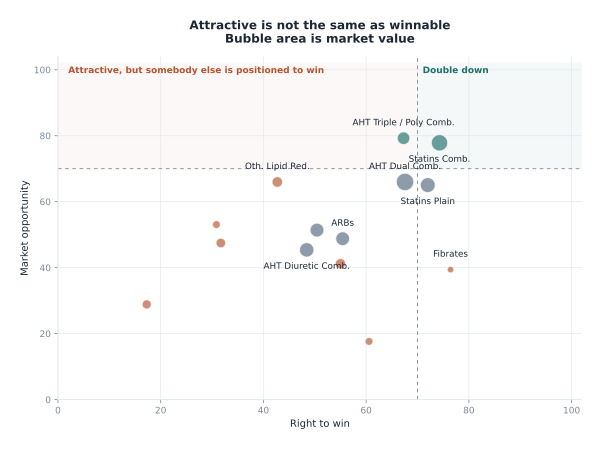
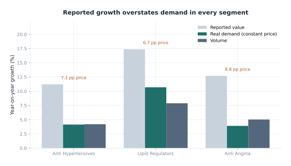

# Cardiac Opportunity Agent

An AI agent that reads the India Cardiac prescription audit, fuses it with a
cited corpus of external signals, and ranks the opportunity spaces where Cipla
has a clear and sustainable right to win over the next three to five years.

Built for **Ascend Season 4 (2026)**, case study *AI-Enabled Prioritization with
Integrated Trend Analytics*.

---

## The one design decision that matters

**The language model never calculates a number.**

Every figure comes from a deterministic analytics engine written in ordinary
Python. The model plans, selects tools, and writes prose about a finished
evidence pack. Before any answer is released, a verifier extracts every number
from the draft and checks it against that pack. Anything it cannot trace is
rejected and the answer is rewritten.

That separation is what makes the output auditable. Re-run the engine on the
same workbook and you get the same scorecard, byte for byte, whether or not a
model was involved. It also means the system answers correctly with no API key
at all, because the numbers were never the model's job.

---

## What it found

Cipla holds **1.68 per cent** of a **₹23,244 crore** market and grows at
**4.6 per cent** against the market's **13.3 per cent**. It ranks nineteenth of
279 companies. Two configurations inside that market are winnable, and both sit
next to brands Cipla already owns.

The chart is the whole argument in one view. The vertical axis rates a space
for anybody. The horizontal axis asks whether Cipla specifically can win it.
Keeping them apart is what stops an attractive but inaccessible space from
being recommended.

[Read the full answers](case-answers.html){: .btn .btn-primary }
[See the framework](PRIORITIZATION_FRAMEWORK.html){: .btn }

---

## Where the growth actually comes from

Seven of the thirteen points of headline market growth are price rather than
demand. The organisers' glossary is explicit that constant-price MAT measures
real demand and quantity confirms it, so reported value growth carries no
weight at all in the framework's future-potential pillar.

---

## How to read this site

| If you want to | Read |
| --- | --- |
| The answers to the four case questions | [Case answers](case-answers.html) |
| Every metric, weight and formula | [Prioritisation framework](PRIORITIZATION_FRAMEWORK.html) |
| How the system is put together | [Architecture](ARCHITECTURE.html) |
| To run it yourself | [Installation](INSTALLATION.html) then [User guide](USER_GUIDE.html) |
| To extend it | [Technical documentation](TECHNICAL_DOCUMENTATION.html) |
| To challenge a judgement call | [Assumptions](ASSUMPTIONS.html) and [Limitations](LIMITATIONS.html) |
| To check it works | [Evaluation](EVALUATION.html) and [Testing](TESTING.html) |
| The sources | [Appendix of sources](appendix-sources.html) |

---

## Verification at a glance

| Measure | Result |
| --- | --- |
| Golden question set | 14 of 14 passing |
| Groundedness | 100 per cent |
| Tool recall | 100 per cent |
| Citation validity | 100 per cent |
| Refusal accuracy | 100 per cent |
| Test suite | 150 tests passing |
| Median answer latency | 74 ms |

Nothing here is scored by another language model. An LLM-as-judge number is
cheap to produce and impossible to defend when a panel asks how the judge was
validated, so every measure above is a deterministic assertion against the run.

---

## Deliverables

- [Round-one deck](https://github.com/ShreyasThakur11/cipla-cardiac-opportunity-agent/raw/main/deliverables/Cardiac_Opportunity_Agent_Round1.pptx) (cover, three slides, four appendix)
- [Detailed deck](https://github.com/ShreyasThakur11/cipla-cardiac-opportunity-agent/raw/main/deliverables/Cardiac_Opportunity_Agent_Detailed.pptx) (the shortlist version)
- [Case answers](case-answers.html)
- [Slide storyboard](slide-storyboard.html)
- [Appendix of sources](appendix-sources.html)
