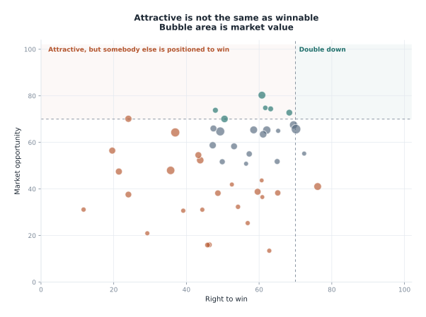
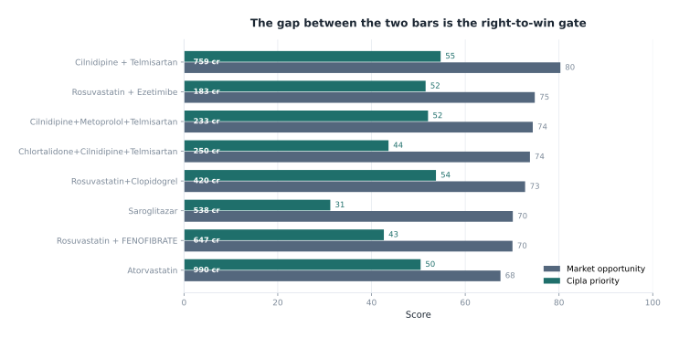
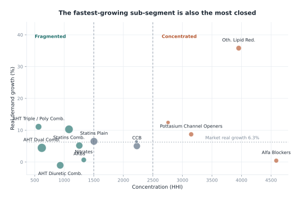
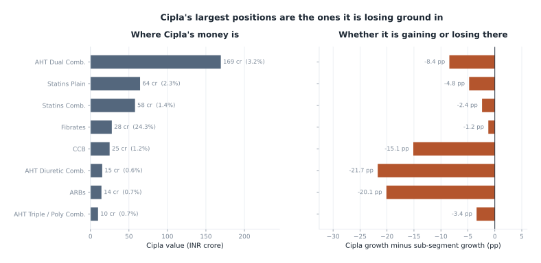
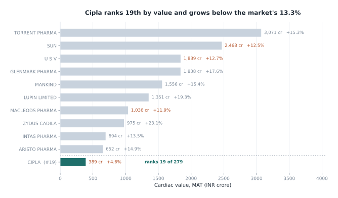
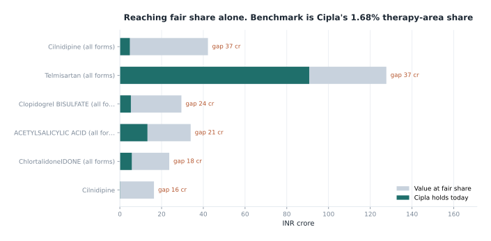
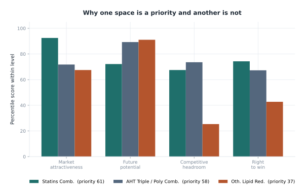
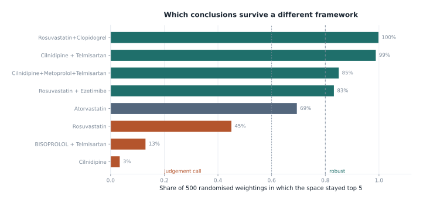
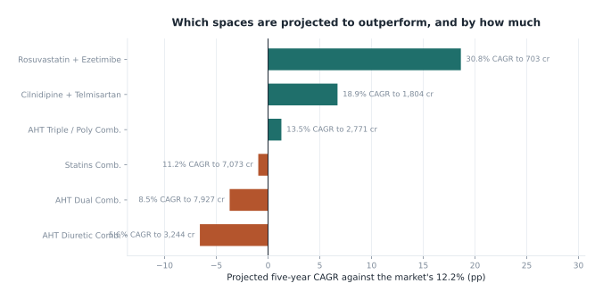

# Chart gallery

Every chart on this site is generated from the live analysis by
`scripts/build_visuals.py`, not drawn by hand. Re-run it after any change to
the data or the framework and every figure updates together, so a chart cannot
disagree with the scorecard behind it.

```bash
python scripts/build_visuals.py
```

Each is written as both PNG at 200 dpi, for the deck, and SVG, for this site.

---

## Where the market's growth comes from


Three readings of the same market. Reported value moves on price and demand
together. Constant-price MAT holds prices at the prior year, so its growth is
demand. Quantity confirms it. The gap between the first two bars is the price
contribution, and it is substantial in every segment.

This is why reported value growth carries no weight in the framework's
future-potential pillar.

---

## Opportunity against right to win


The vertical axis rates a space for anybody. The horizontal axis asks whether
Cipla specifically can win it. The top-right quadrant is where to spend. The
top-left is a real opportunity that somebody else is positioned to win, and
naming those is as useful as naming the targets.

The same view at molecule-combination level, which is where a launch decision
is actually taken:



---

## The ranked shortlist



Two bars per space. The upper bar is the market opportunity index; the lower is
that index after the right-to-win gate. The distance between them is the cost
of not being positioned.

---

## Growth against concentration



The fastest-growing sub-segment in the market is also the most concentrated.
A framework that ranked on growth alone would recommend it. The
competitive-headroom pillar exists to catch exactly this pattern.

---

## Where Cipla stands



On the left, where Cipla's cardiac revenue sits. On the right, whether it is
gaining or losing ground in each of those spaces. The largest positions are the
ones losing ground, which is the central tension in the recommendation.



---

## Underpenetration



The pale bar is what Cipla would hold at its fair share of each franchise. The
solid bar is what it holds today. The difference is the prize from reaching
parity alone, before any share gain.

Anchor-molecule franchises overlap by design, so read them as franchises rather
than adding them up.

---

## Why one space is a priority and another is not



The same three sub-segments, broken into the four pillars. Other Lipid Reducers
scores well on future potential and poorly on competitive headroom and right to
win, which is what moves it from sixth on attractiveness to a harvest verdict.

---

## Robustness



Every weight block redrawn from a Dirichlet distribution centred on the
configured values, and the market re-scored 500 times. The bar is how often
each space stayed in the top five. Above 80 per cent the recommendation
survives almost any reasonable weighting; below 60 per cent it is a judgement
call and is presented as one.

---

## The five-year view



Projected five-year CAGR against the market's rate. Growth mean-reverts towards
the therapy-area rate, so nothing is projected to sustain its current rate.
These are structured extrapolations from two years of history, not plans.
